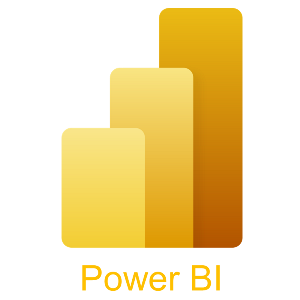

## Cathy Wu (吳逸家)

- **Birthday:** 2002/09/22
- **Education:** 國立台北大學 / 企業管理學系
- **E-mail:** ococ1022@gmail.com
- **Certification:**
  - Google Developer 開發者社群社員
  - Python/SQL 商業資料分析&視覺化與網路爬蟲入門共學營證明
  - NVIDIA 深度機器學習基礎證書

## 技能列

 &nbsp;
 &nbsp;
 &nbsp;
 &nbsp;
 &nbsp;
 &nbsp;
 &nbsp;
 &nbsp;
 &nbsp;
 &nbsp;
&nbsp;

## 數據分析專案

- **SQL營收與使用者資料分析專案**
  - 從整體資料庫架設到後續進行RFM分析潛在客戶
  - 
    
- **WEKA分析研究音樂產業趨勢並連結音樂取向與心理疾病的影響**
  - 整理數據並透過簡單的敘述性分析了解數據內容
  - 利用weka中apriori及hotspot，與預測性分析則利用Bayes net,naive Bayes,logistic,及j48
  - 特殊發現:
    - 罹患心理疾病的年齡層普遍偏低
    - 常聽節奏快、震動強的音樂如遊戲音樂、搖滾樂、EDM、R&B，工作時聽音樂以及每日聆聽音樂時間過長，更有機會成為心理疾病潛在患者
    - 有強迫症的受眾對於EDM有更多的偏好(相關性強)
    - KPOP、Jazz、country跟latin對於心理疾病緩解較有效，並與關聯性分析的分群結果相同
    - Metal和Videogame Music的受眾似乎對於音樂治療的效果產生了負面影響，同與分群結果相同
  - [查看 PDF 文件](https://github.com/yichiaaa/Data_Analysis/blob/01f3fdfedebee07c2c329a05fbf7d453556ec89a/WEKA%E5%88%86%E6%9E%90%E7%A0%94%E7%A9%B6%E9%9F%B3%E6%A8%82%E7%94%A2%E6%A5%AD%E8%B6%A8%E5%8B%A2%E4%B8%A6%E9%80%A3%E7%B5%90%E9%9F%B3%E6%A8%82%E5%8F%96%E5%90%91%E8%88%87%E5%BF%83%E7%90%86%E7%96%BE%E7%97%85%E7%9A%84%E5%BD%B1%E9%9F%BF.pdf)
  
- **WEKA分析大眾對於載具使用之相容性與發票捐贈之影響**
  - 台灣每年發票量約 80 餘億張，相當於砍伐 8 萬棵樹。每本發票估算其成本約為 15 元，若完成電子化每年可節省 1,200 億元花費。
  - 利用weka中apriori及hotspot，與預測性分析則利用RandomForest,logistic,及j48
  - 特殊發現:
    - 北部地區使、具有大學以上學歷、經濟收入低於$26,400，有94.23%的載具使用者
    - 高收入且年齡較高的族群使用率較少，可以向這個族群中的居住於北部及大學教育程度以上的市場推廣載具這項服務
    - 問卷數據中顯示不知道愛心捐贈碼的樣本佔55%，且可觀察到曾經捐贈過發票但不知道捐贈碼的樣本亦是多數
    - 依變數使用"是否為載具使用者"來對此模型做RandomForest，得出結論為此模型之平均精確率達76%
  - [查看 PDF 文件](https://github.com/yichiaaa/Data_Analysis/blob/01f3fdfedebee07c2c329a05fbf7d453556ec89a/WEKA%E5%A4%A7%E7%9C%BE%E5%B0%8D%E6%96%BC%E8%BC%89%E5%85%B7%E4%BD%BF%E7%94%A8%E4%B9%8B%E7%9B%B8%E5%AE%B9%E6%80%A7%E8%88%87%E7%99%BC%E7%A5%A8%E6%8D%90%E8%B4%88%E4%B9%8B%E5%BD%B1%E9%9F%BF.pdf))

- **儒鴻紡織-財務報表分析**
  - 產業分析內外部、財報報表之靜態與動態分析
  - 重要會計政策關鍵查核事項與重要會計項目分析、企業價值分析(股利折現法、現金流量折現法、市場法)
  - 特殊發現:
    - 收入認列嚴謹：產品交付時認列收入，需嚴格內控，應對外部政策影響。
    - 應收帳款管理：採用預期信用損失模型，需平衡簡化和全面理解風險。
    - 存貨管理：提前儲備原料應對供應鏈風險，以成本與淨變現價值孰低原則衡量。
    - 關係人交易透明：無異常交易，高透明度，減少盈餘管理和利益輸送風險。
  - [查看 PDF 文件](https://github.com/yichiaaa/Data_Analysis/blob/01f3fdfedebee07c2c329a05fbf7d453556ec89a/%E5%84%92%E9%B4%BB%E7%B4%A1%E7%B9%94-%E8%B2%A1%E5%8B%99%E5%A0%B1%E8%A1%A8%E5%88%86%E6%9E%90.pdf)

## 網頁爬蟲分析專案
- **基礎爬蟲專案**
  - LINE電影聲量與Youtube網頁爬蟲結果
  - 使用 requests 和 BeautifulSoup 處理靜態頁面，selenium 處理動態頁面。
  - 網站連結: [單頁爬蟲](https://github.com/yichiaaa/Data_Analysis/blob/9fd793a3f3a5a1879054e16a11053b0fc7953fa7/da.md)

- **政府公開資料API爬蟲專案**
  - 資料抓取與處理：用 `requests` 套件從 API 取得氣象數據，轉換為 Python 字典進行處理。
  - 資料儲存：使用 `csv.DictWriter` 將數據寫入 `weather_data.csv`。
  - 定時自動執行：利用 `apscheduler` 每 10 分鐘自動更新 CSV 檔案。
  -  網站連結: [open API爬蟲執行方式](https://github.com/yichiaaa/Data_Analysis/blob/e63738b99f10eb8e388ef4d13cee8939290bc0c5/open_api.md)

- **ptt爬蟲分析專案**
  - 使用 Scrapy 框架爬取 PTT 股票看板的內容，並儲存為 CSV 檔案。
  - 了解Scrapy 優勢與要求：Scrapy 提供全面框架，適合大型專案，但需了解架構設定和數據處理。
  - 展示了如何爬取多頁面內容，控制爬蟲速度，並處理數據存儲。
  - 網站連結: [ptt多頁爬蟲](https://github.com/yichiaaa/Data_Analysis/blob/41b8fea74993931339a6e837df06d14f27b8ee50/ptt.md)
  
## HTML/CSS 程式碼

- **虛擬網站架設**
  - 網站企劃(Website Planning)之課程專案，設計一虛擬台北美食推薦網頁
  - 並利用hover增加美食評分，增加了推薦按鈕，並嵌入了 Google 地圖的網頁增加使用趣味性
  - 網站連結: https://yichiaaa.github.io/my-website/
  
## c# 程式碼

- **骰寶賭博遊戲**
  - 設計遊戲介面及遊玩方式，讓玩家進入後可自行下注金額，並遊玩骰寶遊戲
  - 網站連結: [dice game](https://github.com/yichiaaa/c/blob/be0184d69acaa35338f84d0c0002d7f7522b3a95/dice.md)
    
- **學生成績資訊系統與記帳系統延伸**
  - 利用下拉式清單與其他視窗，提升使用者體驗與增加程式的豐富性
  - 網站連結: [score game](https://github.com/yichiaaa/c/blob/be0184d69acaa35338f84d0c0002d7f7522b3a95/score.md)
  
  
